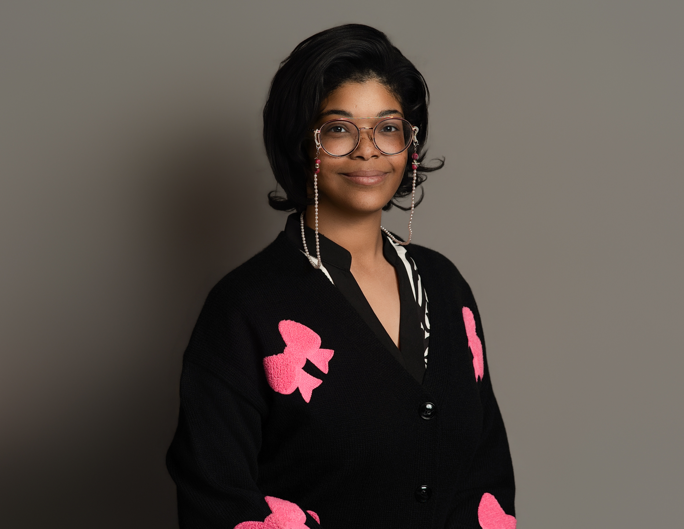

<div align="center">

<!-- Add your uploaded headshot to this repo as assets/profile.jpg -->


# 💗 Hey, I'm Layla!
### 🛡️ Cybersecurity Student • 🔎 Security Analyst in Training • 💻 Builder & Troubleshooter


</div>

---

## 🌸 About Me

Hi! I'm **Layla**, an early cybersecurity professional currently earning my **B.S. in Cybersecurity and Information Assurance at WGU**. 🧠💻

I love the part of cybersecurity where you get to **investigate what happened, figure out why it happened, and build something that makes the next investigation easier**.

My interests include:

- 🔎 **Security Operations & Threat Detection**
- 🧪 **Threat Hunting & Incident Investigation**
- 🐍 **Python Automation**
- 📊 **SIEM / Log Analysis**
- 🧰 **IT Support & Troubleshooting**
- 🛡️ **Security Awareness & Risk**
- 🖥️ **PC Building & Hardware Troubleshooting**

When I'm not buried in logs, Python, or certification material, I'm probably gaming, listening to music, or making my desktop aggressively pink. 🎀✨

---

## 🎓 Education

**Western Governors University (WGU)**  
🎓 B.S. Cybersecurity and Information Assurance

---

## 🏆 Certifications


### 📚 Currently Working Toward

- 🧠 CompTIA CySA+
- 🐧 Linux Essentials
- 🔐 PenTest+
- 📊 Data+

---

## 🧰 Tech Stack & Tools

### 🔐 Security


### 💻 Programming & Automation


### 🖥️ Systems


---

## 🚨 Featured Projects

### 🎣 Phishing Triage Automation
A Python-based phishing investigation workflow that:

- 📩 Parses suspicious emails
- 🔍 Extracts indicators of compromise (IOCs)
- 🌐 Enriches domains, IP addresses, URLs, and hashes
- 🧠 Assigns a verdict such as **Likely Benign**, **Suspicious**, or **Malicious**
- 🎫 Builds and submits help-desk/security ticket payloads
- 🗃️ Tracks ticket activity with a local ledger
- 🔐 Keeps API keys out of source code using environment variables

**What I practiced:** Python packaging, APIs, IOC enrichment, security automation, ticketing workflows, debugging, and secure configuration.

---

### 🔎 Splunk Authentication Investigation

[](https://github.com/NaviSleepy/splunk-auth-investigation)

A hands-on investigation of authentication activity using Splunk, including:

- 🚫 Failed login analysis
- ✅ Successful authentication correlation
- 👥 Multiple-account login attempts
- 🌐 Source IP analysis
- ⏱️ Event timeline reconstruction
- 🕵🏾 Detection of suspicious authentication behavior

**What I practiced:** SPL, log analysis, incident investigation, pattern recognition, and communicating findings.

---

### 🖥️ PC Troubleshooting & Hardware Lab

I built and troubleshoot my own gaming PC and use real hardware problems as learning opportunities.

One of my favorite troubleshooting cases involved a system that shut down during high-load gaming with no BSOD. I worked through logs, BIOS checks, hardware isolation, and component testing until the issue was narrowed down and resolved by replacing the PSU. 🔧⚡

**What I practiced:** Event Viewer, BIOS/UEFI, hardware diagnostics, root-cause analysis, and systematic troubleshooting.

---

## 🧠 How I Approach Problems

```text
Observe 👀
   ↓
Gather Evidence 🔎
   ↓
Form a Hypothesis 🧠
   ↓
Test It 🧪
   ↓
Document What Happened 📝
   ↓
Automate It If I Can 🤖
```

I try not to jump straight to a fix. I want to understand **why** something happened so I can explain it, reproduce it, and prevent it from happening again.

---

## 🌱 What I'm Learning Right Now

- 🕵🏾 Threat hunting methodology
- 🚨 Detection engineering fundamentals
- 🧪 Indicators of compromise and enrichment
- 🐍 Python for cybersecurity automation
- 📊 SIEM investigation workflows
- 🧠 CySA+ concepts
- 🐧 Linux security fundamentals

---

## 💼 Career Goals

I'm building toward roles where I can combine **technical investigation, security analysis, automation, and communication**.

Roles I'm especially interested in:

- 🛡️ SOC Analyst
- 🔎 Cybersecurity Analyst
- 🕵🏾 Threat Hunter
- 🚨 Incident Response Analyst
- 📚 Security Awareness / Training
- 📋 Governance, Risk & Compliance

---

## 🎀 A Little More About Me

- 🎮 Gamer
- 🎧 Music is basically part of my operating system
- 🖥️ I love building and troubleshooting PCs
- 🌸 Pink tech aesthetic enthusiast
- 🧠 I genuinely enjoy teaching technical concepts in ways that make them easier to understand
- ✨ I learn best by doing, breaking things, fixing them, and documenting what I learned

---

## 📈 GitHub Stats

<div align="center">


</div>

---

## 💌 Let's Connect

<div align="center">

[](https://github.com/NaviSleepy)

💗 **Building one project, one investigation, and one certification at a time.**

</div>
